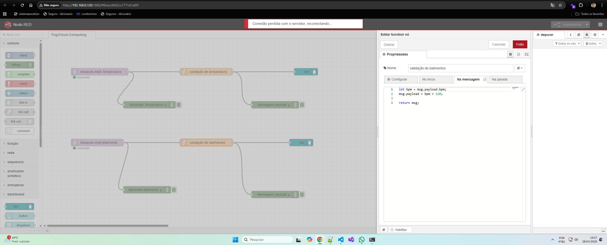
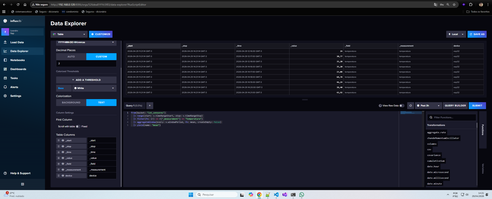

# FIAP — Faculdade de Informática e Administração Paulista

<p align="center">
  
</p>

<h1 align="center">💓 CardioIA Conectada</h1>
<h3 align="center">Monitoramento Contínuo de Sinais Vitais com IoT, Edge Computing e Visualização em Nuvem</h3>

<p align="center">
  <em>"Capturando cada batimento, processando na borda, visualizando na nuvem — em tempo real."</em>
</p>

<p align="center">
  
  
  
</p>

<p align="center">
  
  
  
  
  
  
</p>

---

## 📌 Visão Geral

O **CardioIA Conectada** é um protótipo funcional de sistema vestível de monitoramento cardíaco, desenvolvido como entrega da Fase 3 do projeto CardioIA no curso de Inteligência Artificial da FIAP. O projeto demonstra, de forma prática e técnica, o ciclo completo de um sistema IoT aplicado à saúde digital: **captura → processamento → transmissão → visualização → alerta**.

A solução não é apenas uma leitura de sensores. O CardioIA propõe uma arquitetura distribuída em três camadas — Edge, Fog e Cloud — onde cada nível tem responsabilidades claras e bem definidas. O ESP32 atua como dispositivo de borda inteligente, capaz de coletar dados, aplicar lógica local e garantir resiliência offline. O Node-RED funciona como camada de fog, roteando dados, aplicando regras de negócio e exibindo dashboards em tempo real. O InfluxDB e o Grafana formam a camada de nuvem, responsável pelo armazenamento histórico e pela visualização avançada de séries temporais.

> ⚠️ **Aviso:** este projeto é uma proposta acadêmica e não deve ser utilizado como dispositivo médico real. O monitoramento clínico de pacientes exige equipamentos certificados e supervisão de profissionais de saúde habilitados.

---

## 🌍 Por que isto importa

O mercado global de dispositivos IoT para saúde (IoMT — Internet of Medical Things) ultrapassa **US$ 180 bilhões** e cresce a taxas superiores a 25% ao ano. Wearables cardíacos, oxímetros conectados e monitores de pressão inteligentes já fazem parte da rotina de milhões de pacientes ao redor do mundo.

O desafio central não está nos sensores — está na infraestrutura de dados. A maioria dos dispositivos captura sinais vitais, mas falha em três pontos críticos: **resiliência offline** (o que acontece quando a conexão cai?), **latência de alerta** (quanto tempo leva para o profissional de saúde ser notificado?) e **rastreabilidade histórica** (onde ficam os dados coletados ao longo do tempo?).

O CardioIA Conectada aborda exatamente esses três pontos, demonstrando que é possível construir uma solução robusta, escalável e aplicável em contextos reais de saúde digital — com tecnologias acessíveis, open source e bem documentadas.

---

## 🎯 Objetivo da Fase 3

A Fase 3 tem como foco a **integração completa das camadas de IoT**, desde a captura de sinais vitais simulados até a visualização em dashboards com alertas automáticos.

### Entregas desta fase

- Simulação de sensores no Wokwi com ESP32 (DHT22 + PIR / DHT22 + Botão)
- Implementação de resiliência offline com buffer FIFO local (Edge Computing)
- Transmissão de dados via protocolo MQTT para broker Mosquitto
- Dashboard em tempo real no Node-RED com gráficos, gauge e alertas
- Integração com InfluxDB para armazenamento de séries temporais
- Visualização avançada no Grafana Cloud
- Documentação técnica completa (código comentado + relatório)

---

## 🧩 Problema de Negócio

O monitoramento cardíaco contínuo de pacientes enfrenta cinco desafios estruturais que o CardioIA se propõe a endereçar:

**1. Dependência total de conectividade**
A maioria dos sistemas IoT de saúde assume conectividade permanente. Quando a rede falha — seja por queda de Wi-Fi, interferência eletromagnética em ambientes hospitalares ou troca de ala — os dados são perdidos. O CardioIA resolve isso com um buffer local no próprio dispositivo.

**2. Latência de alerta**
Em cenários críticos como taquicardia (BPM > 120) ou febre (temperatura > 38°C), cada segundo conta. Sistemas que dependem da nuvem para gerar alertas têm latência inaceitável. O CardioIA processa regras de alerta localmente no ESP32, sem depender de conexão.

**3. Ausência de rastreabilidade histórica**
Dados de sinais vitais têm valor clínico acumulado ao longo do tempo. Um pico de temperatura isolado é menos relevante do que a tendência de três dias. O CardioIA armazena séries temporais no InfluxDB, permitindo análise histórica completa.

**4. Falta de visibilidade operacional em tempo real**
Profissionais de saúde precisam de dashboards claros, com indicadores visuais e alertas contextuais — não de logs brutos. O Node-RED e o Grafana entregam essa camada de observabilidade.

**5. Complexidade de integração entre camadas**
Edge, Fog e Cloud são conceitos bem definidos na literatura, mas raramente demonstrados de forma integrada em protótipos funcionais. O CardioIA implementa essa arquitetura completa de ponta a ponta.

---

## 💼 Valor para o Negócio

| Stakeholder | Dor atual | Valor entregue pelo CardioIA |
|---|---|---|
| **Paciente monitorado** | Dispositivos perdem dados quando há queda de conexão | Resiliência offline garante continuidade da coleta sem perda de registros |
| **Profissional de saúde** | Alertas lentos ou ausentes em situações críticas | Alertas automáticos em tempo real via dashboard com thresholds configuráveis |
| **Equipe de TI hospitalar** | Infraestrutura complexa e cara para IoT médico | Stack open source (Mosquitto, Node-RED, InfluxDB, Grafana) de fácil manutenção |
| **Gestão hospitalar** | Sem visibilidade histórica dos sinais vitais coletados | Séries temporais armazenadas no InfluxDB com dashboards Grafana para análise |
| **Desenvolvedores e pesquisadores** | Falta de referência técnica para IoT em saúde | Arquitetura documentada, código comentado e fluxo completo demonstrado |

---

## 💡 Solução Proposta

O CardioIA Conectada implementa um pipeline de IoT composto por quatro camadas funcionais integradas:

### Camada 1 — Captura de Sinais Vitais (Edge Device)

O ESP32, simulado no Wokwi, coleta dados dos sensores a cada intervalo configurado. O DHT22 fornece temperatura e umidade. O sensor PIR detecta presença e movimento. O botão simula batimentos cardíacos (BPM). Todos os dados são serializados em JSON e prontos para transmissão ou armazenamento local.

### Camada 2 — Processamento Local e Resiliência (Edge Computing)

Antes de qualquer transmissão, o ESP32 aplica lógica local: valida leituras, aplica regras de alerta (febre, presença) e gerencia o buffer offline. Com política FIFO de até 20 amostras, o sistema garante continuidade da coleta mesmo sem conexão, sincronizando automaticamente quando a rede é restabelecida.

### Camada 3 — Transmissão e Roteamento (Fog Computing)

Os dados são publicados via MQTT no broker Mosquitto. O Node-RED subscreve os tópicos, parseia os payloads JSON, aplica regras de negócio (alertas de taquicardia e febre) e exibe os dados em dashboards interativos em tempo real. O Node-RED também encaminha os dados para o InfluxDB.

### Camada 4 — Armazenamento Histórico e Visualização (Cloud)

O InfluxDB armazena os dados como séries temporais com timestamps automáticos. O Grafana consome essa base e entrega dashboards avançados com gráficos históricos, painéis de tendência e alertas persistentes configuráveis.

---

## 🏗️ Arquitetura da Solução

### Fluxo Técnico Completo

```
1.  Coleta de dados (DHT22 + PIR / Botão)    →  Leitura periódica no ESP32
2.  Validação local da leitura               →  isnan() para integridade dos dados
3.  Serialização em JSON                     →  ArduinoJson
4.  Verificação de conectividade             →  Variável booleana / WiFi.status()
5.  Decisão: online ou offline               →  Condicional no loop()
6.  [Offline] Armazenamento em buffer FIFO   →  Array local, até 20 amostras
7.  [Online] Sincronização do buffer         →  syncData() ao restabelecer conexão
8.  Publicação via MQTT                      →  PubSubClient → Mosquitto Broker
9.  Recepção no Node-RED                     →  Subscribe nos tópicos MQTT
10. Parse e roteamento                       →  Extração dos campos JSON
11. Aplicação de regras de alerta            →  BPM > 120 / Temp > 38°C
12. Exibição no dashboard                    →  Chart, Gauge, Alerta visual
13. Persistência no InfluxDB                 →  Séries temporais com timestamp
14. Visualização no Grafana                  →  Dashboards históricos e tendências
```

### Stack Tecnológico

| Camada | Tecnologia | Justificativa |
|---|---|---|
| **Microcontrolador** | ESP32 (Wokwi) | Plataforma IoT amplamente adotada, Wi-Fi integrado, suporte a C++ |
| **Sensor de temperatura/umidade** | DHT22 | Precisão adequada para monitoramento clínico básico |
| **Sensor de movimento** | PIR | Detecção de presença/queda sem contato físico |
| **Simulação de BPM** | Botão + contagem temporal | Simula frequência cardíaca sem sensor físico dedicado |
| **Serialização** | ArduinoJson | Biblioteca leve e eficiente para JSON no ESP32 |
| **Protocolo de comunicação** | MQTT (PubSubClient) | Baixo overhead, publish/subscribe, ideal para IoT |
| **Broker MQTT** | Mosquitto | Open source, leve, amplamente adotado em produção |
| **Camada de fog** | Node-RED | Orquestração visual de fluxos, dashboard integrado |
| **Banco de séries temporais** | InfluxDB | Otimizado para dados temporais de alta frequência |
| **Visualização avançada** | Grafana | Dashboards customizáveis, alertas, consultas Flux |
| **Simulador** | Wokwi (VS Code + PlatformIO) | Simulação fiel do ESP32 sem necessidade de hardware físico |

### Diagrama de Arquitetura

```
┌─────────────────────────────────────────────────────────────────┐
│                        EDGE LAYER                               │
│                                                                 │
│   ┌──────────┐    ┌──────────┐    ┌──────────┐                  │
│   │  DHT22   │    │   PIR    │    │  Botão   │                  │
│   │ Temp/Umi │    │Movimento │    │   BPM    │                  │
│   └────┬─────┘    └────┬─────┘    └────┬─────┘                  │
│        └───────────────┴───────────────┘                        │
│                         │                                       │
│                    ┌────▼─────┐                                 │
│                    │  ESP32   │  ← Lógica local + Buffer FIFO   │
│                    │ (Wokwi)  │  ← Alertas offline              │
│                    └────┬─────┘                                 │
└─────────────────────────┼───────────────────────────────────────┘
                          │ MQTT (PubSubClient)
                          │ sensor/temperatura
                          │ sensor/batimentos
┌─────────────────────────┼───────────────────────────────────────┐
│                    FOG LAYER                                    │
│                         │                                       │
│                    ┌────▼──────┐                                │
│                    │ Mosquitto │  ← Broker MQTT local           │
│                    │  Broker   │                                │
│                    └────┬──────┘                                │
│                         │                                       │
│                    ┌────▼──────┐                                │
│                    │ Node-RED  │  ← Dashboard tempo real        │
│                    │           │  ← Regras de alerta            │
│                    └────┬──────┘  ← Gráfico BPM + Gauge Temp    │
└─────────────────────────┼───────────────────────────────────────┘
                          │ HTTP / InfluxDB Line Protocol
┌─────────────────────────┼───────────────────────────────────────┐
│                   CLOUD LAYER                                   │
│                         │                                       │
│              ┌──────────▼──────────┐                            │
│              │      InfluxDB       │  ← Séries temporais        │
│              │  (Time Series DB)   │  ← Timestamps automáticos  │
│              └──────────┬──────────┘                            │
│                         │ Flux Query                            │
│              ┌──────────▼──────────┐                            │
│              │       Grafana       │  ← Dashboards históricos   │
│              │    (Visualização)   │  ← Alertas persistentes    │
│              └─────────────────────┘                            │
└─────────────────────────────────────────────────────────────────┘
```

---

## 📦 Estrutura do Repositório

```text
CardioIA/
│
├── Parte_1/
│   ├── src/
│   │   └── prog1.ino
│   ├── assets/
│   │   └── simulacao.png
│   ├── diagram.json
│   ├── platformio.ini
│   └── wokwi.toml
│
├── Parte_2/
│   ├── src/
│   │   └── prog1.ino
│   ├── assets/
│   │   ├── dashboard_batimento_alert.png
│   │   ├── dashboard_batimento_sucess.png
│   │   ├── dashboard_temperatura_alert.png
│   │   ├── dashboard_temperatura_sucess.png
│   │   ├── grafana.png
│   │   ├── imagem_node_red.png
│   │   ├── influxdb.png
│   │   ├── mosquito-mqtt.png
│   │   ├── validacao_batimentos.png
│   │   └── validacao_temperatura.png
│   ├── diagram.json
│   ├── platformio.ini
│   └── wokwi.toml
│
├── relatorio_cardioIA_fase3.pdf
├── README.md
└── .gitignore
```

---

## 🔁 Parte 1 — Edge Computing (Armazenamento e Processamento Local)

### Sensores utilizados

| Sensor | Pino | Dado coletado | Intervalo |
|---|---|---|---|
| DHT22 | GPIO 15 | Temperatura (°C) + Umidade (%) | 5 segundos |
| PIR | GPIO 4 | Movimento (boolean) | 5 segundos |

### Simulação do circuito

<p align="center">
  
</p>

### Payload JSON gerado

```json
{
  "temperatura": 36.5,
  "umidade": 62.0,
  "movimento": false
}
```

### Lógica de resiliência offline

| Situação | Comportamento |
|---|---|
| **Online** | Dados publicados via Serial (simulação de envio) e buffer sincronizado |
| **Offline** | Dados armazenados no buffer local (máx. 20 amostras, política FIFO) |
| **Reconexão** | `syncData()` envia todos os registros pendentes e limpa o buffer |
| **Buffer cheio** | FIFO descarta leitura mais antiga, mantém as 20 mais recentes |

> **Capacidade do buffer:** 20 amostras × 5 segundos = ~1,6 minuto de operação offline sem perda de dados.

### Regras de alerta local

| Condição | Threshold | Mensagem no Serial |
|---|---|---|
| Febre | Temperatura > 38°C | `⚠️ ALERTA: FEBRE DETECTADA` |
| Presença | PIR = HIGH | `⚠️ ALERTA: PRESENÇA DETECTADA` |

---

## 📡 Parte 2 — Fog/Cloud Computing (MQTT + Dashboard + InfluxDB + Grafana)

### Sensores utilizados

| Sensor | Pino | Dado coletado | Tópico MQTT | Intervalo |
|---|---|---|---|---|
| DHT22 | GPIO 15 | Temperatura (°C) | `sensor/temperatura` | 10 segundos |
| Botão | GPIO 22 | BPM (simulado) | `sensor/batimentos` | 10 segundos |
| LED | GPIO 17 | Feedback visual de batimento | — | Por evento |

### Cálculo de BPM

```
BPM = número de pressões do botão × 6
(janela de contagem: 10 segundos)
```

### Configuração MQTT

| Parâmetro | Valor |
|---|---|
| Broker | Mosquitto (Docker local) |
| Porta | 1883 |
| Client ID | `esp32-fiap-01` |
| Tópico temperatura | `sensor/temperatura` |
| Tópico batimentos | `sensor/batimentos` |
| Biblioteca | PubSubClient |
| Reconexão automática | Sim (`reconnect_mqtt()`) |

Containers Docker com todos os serviços ativos (Mosquitto, Node-RED, InfluxDB e Grafana):

<p align="center">
  
</p>

### Fluxo Node-RED

O fluxo abaixo mostra a integração entre os tópicos MQTT, as regras de alerta e a persistência no InfluxDB:

<p align="center">
  
</p>

### Regras de alerta no Node-RED

| Condição | Threshold | Ação |
|---|---|---|
| Taquicardia | BPM > 120 | Alerta vermelho no dashboard |
| Febre | Temperatura > 38°C | Alerta vermelho no dashboard |

### Validação dos dados recebidos

Confirmação do recebimento correto dos dados de temperatura e batimentos no Node-RED:

<p align="center">
  
  &nbsp;
  
</p>

### Dashboard Node-RED — Temperatura

Temperatura dentro do limite normal e com alerta de febre ativo (> 38°C):

<p align="center">
  
  &nbsp;
  
</p>

### Dashboard Node-RED — Batimentos Cardíacos (BPM)

BPM dentro do limite normal e com alerta de taquicardia ativo (> 120 BPM):

<p align="center">
  
  &nbsp;
  
</p>

### InfluxDB — Armazenamento de Séries Temporais

Dados de temperatura e batimentos armazenados com timestamps no InfluxDB:

<p align="center">
  
</p>

### Grafana — Visualização Avançada

Dashboards históricos gerados pelo Grafana a partir dos dados armazenados no InfluxDB:

<p align="center">
  
</p>

---

## 🤖 Estratégia de IoT e Computação Distribuída

### Edge Computing — Por que processar na borda?

O ESP32 não é apenas um coletor de dados — é um processador de borda inteligente. Ao executar lógica local (validação, alertas, buffer FIFO), o dispositivo garante três propriedades críticas para sistemas médicos:

- **Baixa latência:** alertas de febre ou taquicardia são detectados em milissegundos, sem depender de round-trip até a nuvem
- **Resiliência:** a coleta não para quando a rede cai — os dados são preservados e sincronizados depois
- **Privacidade:** dados sensíveis podem ser filtrados ou anonimizados localmente antes de qualquer transmissão

### Fog Computing — O papel do Node-RED

O Node-RED atua como camada intermediária entre o dispositivo e a nuvem, executando tarefas que seriam pesadas demais para o ESP32 e desnecessárias para a nuvem: parsing de JSON, roteamento condicional, aplicação de regras de negócio e renderização de dashboards em tempo real.

### Cloud Computing — InfluxDB e Grafana

Enquanto o Edge garante a coleta e o Fog garante o fluxo, a nuvem garante a **memória**. O InfluxDB armazena cada leitura com timestamp de nanossegundos, permitindo que o Grafana construa gráficos de tendência, médias móveis e análises históricas que são impossíveis com dados apenas em memória.

---

## 🛡️ Boas Práticas em IoT Médico

| Prática | Implementação no CardioIA |
|---|---|
| **Validação de dados na origem** | `isnan()` garante que leituras inválidas do DHT22 nunca entram no pipeline |
| **Resiliência offline** | Buffer FIFO com capacidade dimensionada para o contexto de uso |
| **Desacoplamento** | MQTT separa produtor (ESP32) de consumidor (Node-RED) — um não depende do outro |
| **Reconexão automática** | `reconnect_mqtt()` garante que quedas momentâneas não interrompam o monitoramento |
| **Separação de responsabilidades** | Edge coleta, Fog roteia, Cloud armazena — cada camada tem papel claro |
| **Alertas baseados em threshold clínico** | Limites de BPM e temperatura definidos com base em referências médicas |

---

## 🚀 Como Executar o Projeto

### Pré-requisitos

- [VS Code](https://code.visualstudio.com/) com extensões **Wokwi** e **PlatformIO**
- [Docker Desktop](https://www.docker.com/products/docker-desktop) instalado e em execução

### Parte 1 — Wokwi (Edge Computing)

1. Abra a pasta `Parte_1/` no VS Code
2. Aguarde o PlatformIO compilar o projeto
3. Clique em **▶ Start Simulation** na extensão Wokwi
4. Acompanhe as leituras e o comportamento offline/online no terminal

### Parte 2 — MQTT + Node-RED + InfluxDB + Grafana

1. Suba o broker Mosquitto:
```bash
docker run -d --name mosquitto -p 1883:1883 eclipse-mosquitto
```

2. Suba o Node-RED:
```bash
docker run -d --name nodered -p 1880:1880 nodered/node-red
```
Acesse: [http://localhost:1880](http://localhost:1880) — importe o arquivo `flows.json` via menu ☰ → Import → Deploy

3. Suba o InfluxDB:
```bash
docker run -d --name influxdb -p 8086:8086 influxdb:2.0
```
Acesse: [http://localhost:8086](http://localhost:8086)

4. Suba o Grafana:
```bash
docker run -d --name grafana -p 3000:3000 grafana/grafana
```
Acesse: [http://localhost:3000](http://localhost:3000) — login: `admin` / `admin`

5. Descubra o IP local da sua máquina:
```bash
ipconfig   # Windows
ifconfig   # Linux/Mac
```

6. Atualize o IP do broker no código `Parte_2/src/prog1.ino`:
```cpp
const char* mqtt_server = "SEU_IP_AQUI";
```

7. Abra a pasta `Parte_2/` no VS Code e inicie a simulação Wokwi

8. Acesse o dashboard Node-RED em: [http://localhost:1880/ui](http://localhost:1880/ui)

---

## ⚠️ Limitações e Trabalhos Futuros

### Limitações Identificadas

- **Ambiente simulado (Wokwi):** ausência de persistência SPIFFS, sem conectividade Wi-Fi real e sem latência de rede. O comportamento do firmware em hardware físico pode divergir em aspectos de temporização e confiabilidade.
- **Sensor de temperatura ambiente:** o DHT22 mede temperatura do ar, não corporal. Substituição por sensor de contato é necessária para aplicação clínica real.
- **Simulação de BPM por botão:** não captura variabilidade de frequência cardíaca (HRV) nem eventos arrítmicos como fibrilão atrial ou extras-sístoles.
- **Segurança da comunicação:** a comunicação MQTT não utiliza TLS/mTLS nem autenticação no broker. Em ambiente de produção com dados de saúde, isso seria inaceitável do ponto de vista regulatório (LGPD, HIPAA).
- **Capacidade de buffer limitada:** 100 segundos de cobertura offline são insuficientes para falhas de rede prolongadas em ambiente hospitalar real.
- **Limiares de alerta fixos:** os valores de 38°C e 120 BPM são parâmetros genéricos; em produção, deveriam ser configuráveis por perfil de paciente.

### Trabalhos Futuros

- **Integração com hardware físico:** validação do firmware em ESP32 DevKit com sensores reais e rede Wi-Fi de produção.
- **Sensor de ECG real:** substituição do botão pelo módulo AD8232, permitindo análise de intervalo R-R e detecção de arritmias.
- **Segurança end-to-end:** implementação de TLS no broker Mosquitto, autenticação por certificado cliente e criptografia dos dados em repouso no InfluxDB.
- **Buffer persistente:** armazenamento em SPIFFS ou cartão microSD para suportar horas de operação offline.
- **Parametrização clínica:** painel de configuração de limiares de alerta por paciente, com integração a prontuário eletrônico.
- **Notificações push:** integração do Node-RED com serviço de mensageria (Telegram Bot, PagerDuty) para alertas fora do dashboard.

---

## 👨‍🎓 Integrantes do Grupo

| Nome | RM | Papel |
|---|---|---|
| Daniele Antonieta Garisto Dias | RM565106 | Product Owner & Analista de Negócio |
| Leandro Augusto Jardim da Cunha | RM561395 | Arquiteto de Solução & Engenheiro de Dados |
| Luiz Eduardo da Silva | RM561701 | Engenheiro de IoT & Firmware |
| João Victor Viana de Sousa | RM565136 | Especialista em Infraestrutura & Documentação |

### Detalhamento por Integrante

**Daniele Antonieta Garisto Dias — Product Owner & Analista de Negócio**
Responsável por traduzir os requisitos da Fase 3 em entregas claras e priorizadas. Lidera a definição do problema de negócio, o mapeamento do valor da solução para cada stakeholder e a documentação da jornada do sistema. Garante que as decisões técnicas estejam alinhadas ao contexto de saúde digital e às boas práticas em IoT médico.

**Leandro Augusto Jardim da Cunha — Arquiteto de Solução & Engenheiro de Dados**
Responsável pelo design técnico da arquitetura distribuída Edge–Fog–Cloud. Define o fluxo de dados de ponta a ponta, as decisões de stack tecnológico e a integração entre Mosquitto, Node-RED, InfluxDB e Grafana. Lidera a modelagem do pipeline de transmissão e o dimensionamento do buffer de resiliência offline.

**Luiz Eduardo da Silva — Engenheiro de IoT & Firmware**
Responsável pela implementação do firmware do ESP32 nas duas partes do projeto. Desenvolve a lógica de leitura dos sensores, serialização JSON, controle de conectividade, buffer FIFO e publicação MQTT. Garante que o código seja eficiente, comentado e resiliente a falhas de rede.

**João Victor Viana de Sousa — Especialista em Infraestrutura & Documentação**
Responsável pela configuração da infraestrutura de fog e cloud (Docker, Mosquitto, Node-RED, InfluxDB, Grafana) e pela documentação técnica completa do projeto. Coordena a organização do repositório, os relatórios e a rastreabilidade das decisões arquiteturais tomadas ao longo da fase.

---

## 👩‍🏫 Professores

**Tutor:** Caique Nonato da Silva Bezerra
**Coordenador:** Andre Godoi Chiovato

---

## 📚 Referências

- BANKS, A.; GUPTA, R. *MQTT Version 3.1.1*. OASIS Standard, 2014. Disponível em: https://docs.oasis-open.org/mqtt/mqtt/v3.1.1/os/mqtt-v3.1.1-os.html
- ESPRESSIF SYSTEMS. *ESP32 Technical Reference Manual*. Versão 5.1. Shangai: Espressif, 2023. Disponível em: https://www.espressif.com/sites/default/files/documentation/esp32_technical_reference_manual_en.pdf
- INFLUXDATA. *InfluxDB Documentation – Time Series Database*. 2024. Disponível em: https://docs.influxdata.com
- GRAFANA LABS. *Grafana Documentation – Open Source Analytics & Monitoring*. 2024. Disponível em: https://grafana.com/docs
- NODE-RED. *Node-RED Documentation – Flow-based Programming for the Internet of Things*. 2024. Disponível em: https://nodered.org/docs
- ECLIPSE FOUNDATION. *Eclipse Mosquitto – An Open Source MQTT Broker*. 2024. Disponível em: https://mosquitto.org
- BENETTI, G. et al. IoT-based Patient Monitoring Systems: A Systematic Review. *Journal of Medical Internet Research*, v. 25, n. 1, 2023.
- BRASIL. Lei nº 13.709, de 14 de agosto de 2018. *Lei Geral de Proteção de Dados Pessoais (LGPD)*. Diário Oficial da União, Brasília, 2018.
- WOKWI. *Wokwi – Online ESP32 and Arduino Simulator*. 2024. Disponível em: https://wokwi.com

---

## 📜 Licença

Projeto desenvolvido exclusivamente para fins acadêmicos no contexto da **Fase 3 do Projeto CardioIA — FIAP, curso de Inteligência Artificial**.

O uso de dados reais de pacientes não faz parte do escopo desta entrega. Todos os sinais vitais são simulados no ambiente Wokwi, sem vínculo com indivíduos reais ou dispositivos médicos certificados.

---

<p align="center">
  Desenvolvido para fins acadêmicos — FIAP, curso de Inteligência Artificial<br>
  <strong>Projeto CardioIA · Fase 3 · 2026</strong>
</p>
